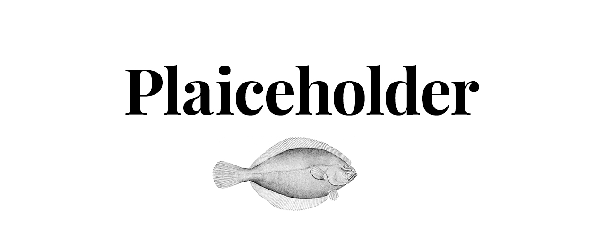
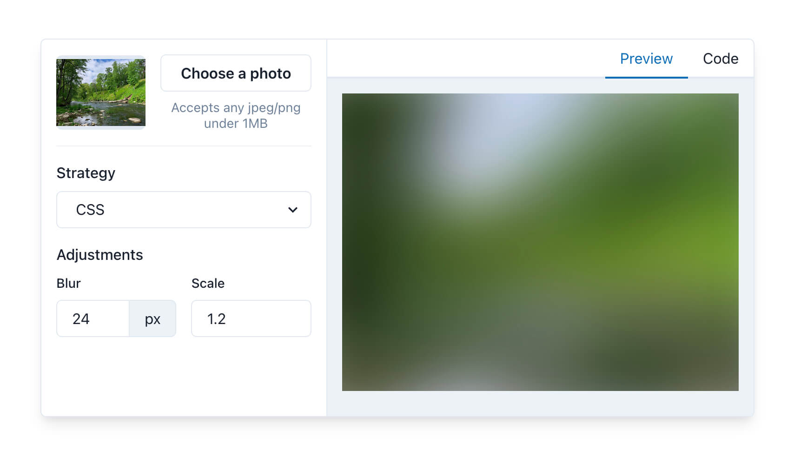

  <strong>
    <a href="ACQUISITION.md">
      Open to Acquisition 🟢
    </a>
  </strong>

---

<h1 align="center">
  plaiceholder
</h1>

  

  <strong>Beautiful image placeholders, without the hassle.</strong>

  Choose-your-own adventure, from pure CSS to SVG…

<a href="https://plaiceholder.co/docs"><strong>Read the Docs 📖</strong></a>
|
<a href="https://plaiceholder.co"><strong>Try the Studio 🎨</strong></a>

  
  
  
  
  

 

## Documentation 📖

Visit **[plaiceholder.co/docs][plaiceholder:docs]** to get started with the open-source free-to-use packages.

## Studio 🎨

[**Project sponsors**][plaiceholder:pricing] get exclusive access to the [**Studio**][plaiceholder].

Upload your images and transform to beautifully lightweight placeholders (like magic, but real) ✨

### Organizations

Support Plaiceholder via your organization. Your logo will show up here **and** on [plaiceholder.co][plaiceholder] with a link to your website.

[See Pricing and T&Cs][plaiceholder:pricing]

---

## License

Apache-2.0 License © [Joe Bell](https://twitter.com/joebell_)

### Acknowledgements

#### [Lovell Fuller](https://github.com/lovell) ([Sharp](https://github.com/lovell/sharp))

Copyright © 2013-2021, Lovell Fuller. All Rights Reserved.

Licensed under the Apache License, Version 2.0 (the "License").

[plaiceholder]: https://plaiceholder.co
[plaiceholder:docs]: https://plaiceholder.co/docs
[plaiceholder:pricing]: https://plaiceholder.co/#pricing
[blurhash]: https://blurha.sh/
[react-blurhash]: https://github.com/woltapp/react-blurhash
[next/image]: https://nextjs.org/docs/basic-features/image-optimization
